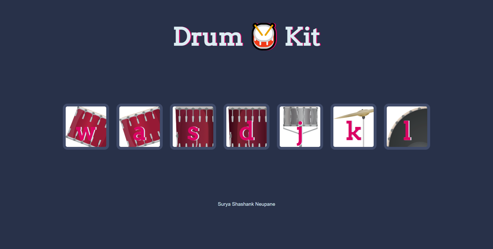

# Drum Kit Website

This project is a simple drum kit website built using HTML, CSS, and JavaScript. It allows users to play different drum sounds by clicking on the corresponding drum pads or pressing the assigned keys on their keyboard.

## Features

-   **Interactive Drum Pads:** Clicking on a drum pad triggers the associated drum sound.
-   **Keyboard Support:** Pressing specific keys on the keyboard also triggers the drum sounds.
-   **Sound Effects:** Includes a variety of drum sounds for different drum elements.
-   **Visual Feedback:** Provides visual feedback (e.g., a brief highlight or animation) when a drum pad is triggered.  *(This is a suggested feature as I don't see it in the image, but it would greatly enhance the UX)*.

## Technologies Used

-   HTML: For structuring the content of the website.
-   CSS: For styling the website and drum pads.
-   JavaScript: For handling user interactions, triggering sounds, and keyboard support.
