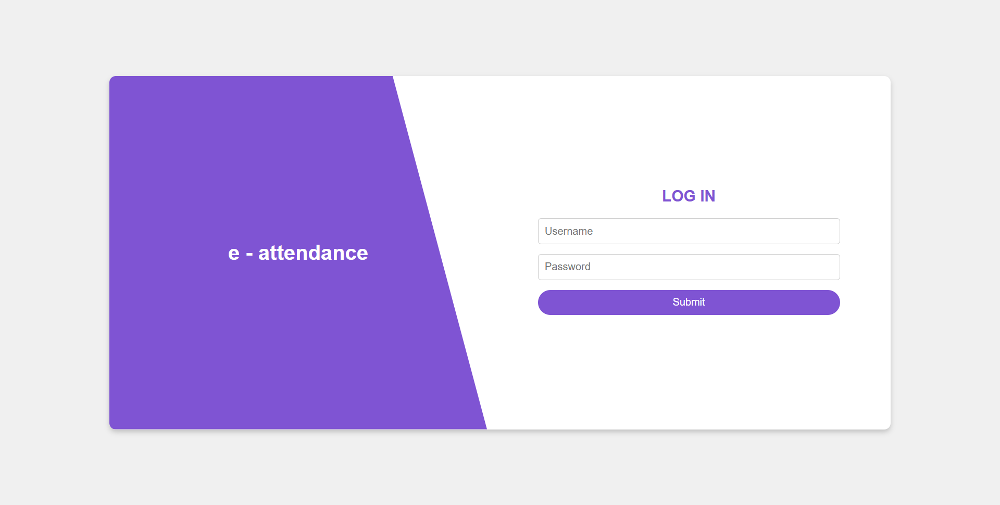
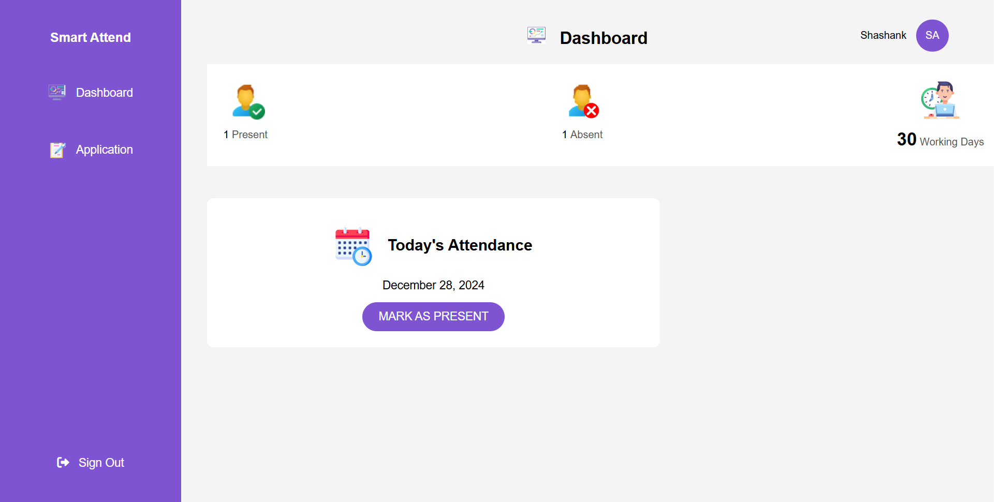
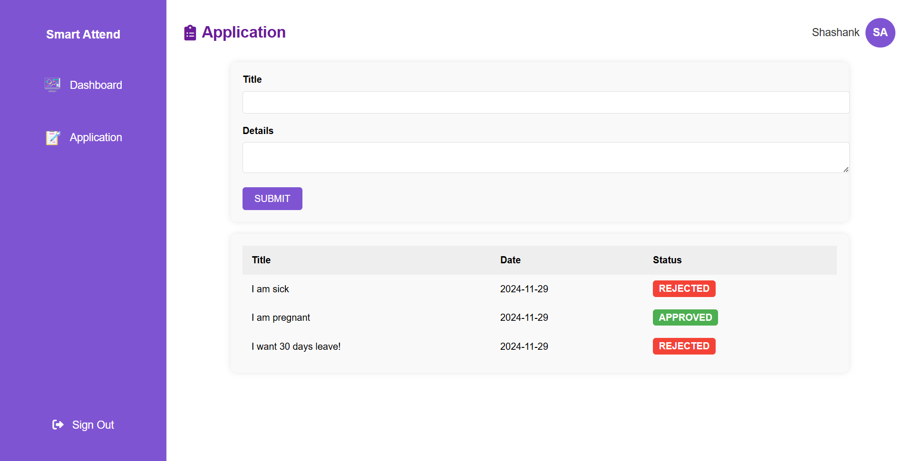
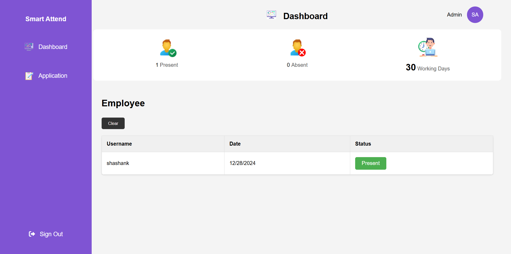

# E-Attendance Website






This is an E-Attendance system designed for seamless management of staff attendance. It allows users to mark themselves as present, submit applications, and view their attendance statistics. The admin panel provides administrators with tools to manage staff attendance, respond to applications, and view detailed attendance records.

---

## Features

### For Users:
- **Mark Attendance**: Users can mark themselves as present.
- **Submit Applications**: Users can write applications (e.g., leave requests) to the admin.
- **View Attendance Stats**: Users can track their attendance history and statistics.

### For Admins:
- **Manage Attendance**: View a list of all present and absent staff.
- **Respond to Applications**: Approve, reject, or comment on applications submitted by users.
- **Attendance Records**: Access detailed attendance logs.

---

## Technologies Used
- **Front-End**: Vanilla JavaScript, HTML, CSS
- **Back-End**: Basic server-side implementation (if applicable)
- **Database**: Simple file or local storage-based data handling (if applicable)

---

## How to Access the Website

### Login Credentials

#### User Login:
- **Username**: `shashank`
- **Password**: `shashank123`

#### Admin Login:
- **Username**: `admin`
- **Password**: `admin`

---

## Installation & Usage

1. **Clone the Repository**:
   ```bash
   https://github.com/shashankneupane0427/E-Attendance-Website.git
   cd e-attendance
