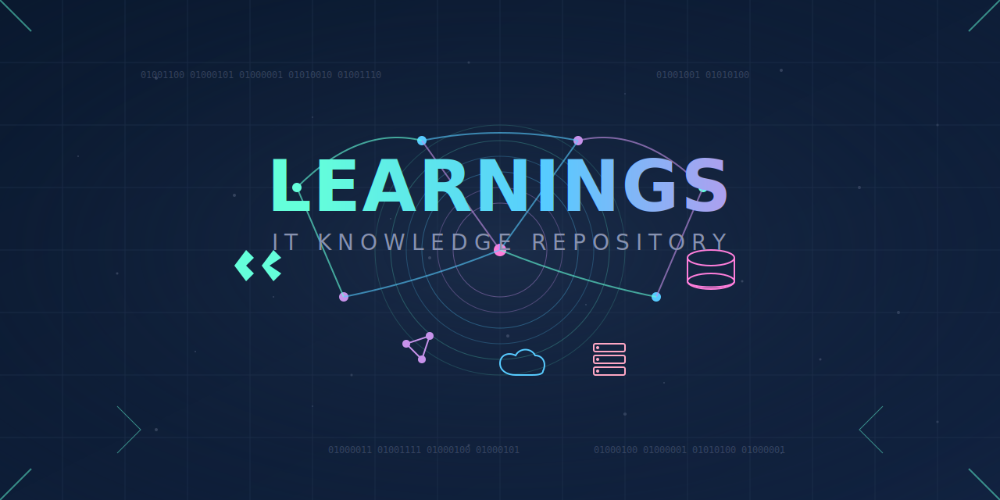

# Learnings



## 🚀 About

**Learnings** is a personal repository where I document my coding journey, experiments, and mini-projects across multiple programming languages. This serves as a playground for practicing algorithms, exploring new frameworks, and strengthening problem-solving skills. 

## 🛠️ Technologies & Languages Covered

- **JavaScript** - Web development, DOM manipulation, ES6+ concepts
- **TypeScript** - Strongly typed JavaScript, interfaces, generics
- **Python** - Scripting, automation, AI/ML, web frameworks
- **C** - Low-level programming, memory management, system programming
- **C++** - Data structures, competitive programming, OOP

## 🏗️ Frameworks & Libraries

- **Frontend**: Next.js, React.js, Tailwind CSS
- **Backend**: Node.js, Express.js, Django, Flask
- **AI/ML**: NumPy, Pandas, Scikit-learn

## 🔥 Three Major Areas

### 1️⃣ Full Stack Development
Building interactive and scalable web applications using modern frontend and backend technologies.

### 2️⃣ AI and Machine Learning
Exploring data science, machine learning models, and AI-driven applications.

### 3️⃣ Data Structures & Algorithms (DSA)
Enhancing problem-solving skills through algorithmic challenges and coding exercises.

## 🏗️ How to Use

1. Clone the repository:
   ```sh
   git clone https://github.com/your-username/Learnings.git
   ```
2. Navigate to the desired language or framework folder and explore code snippets and projects.
3. Contribute by adding new learning materials or improving existing ones.

## 📜 License

This project is open-source and available under the [MIT License](LICENSE).

---

🚀 **Happy Coding!**

