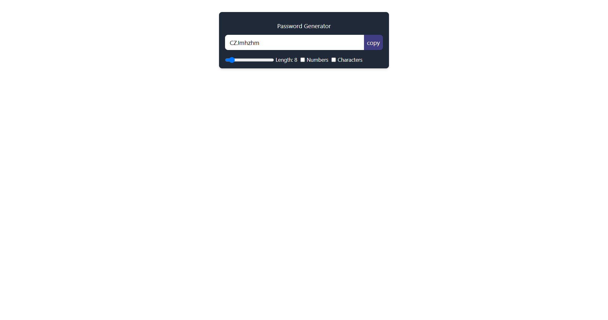

# React Password Generator

This is a simple password generator web application built using React. It allows users to customize the password length and include numbers and special characters.  The generated password can then be easily copied to the clipboard.

## Features

-   **Password Length Adjustment:** Users can select a password length between 6 and 30 characters using a slider.
-   **Character Set Customization:** Users can choose to include numbers and/or special characters in the generated password.
-   **Copy to Clipboard:** A button allows users to quickly copy the generated password to their clipboard.
-   **Responsive Design:** The application is designed to be responsive and work well on different screen sizes.

## Technologies Used

-   React: A JavaScript library for building user interfaces.
-   Tailwind CSS: A utility-first CSS framework for rapidly styling the application.  *(Note: While the code provided uses inline styles in some places, a more robust project would utilize Tailwind classes throughout for better maintainability.)*
