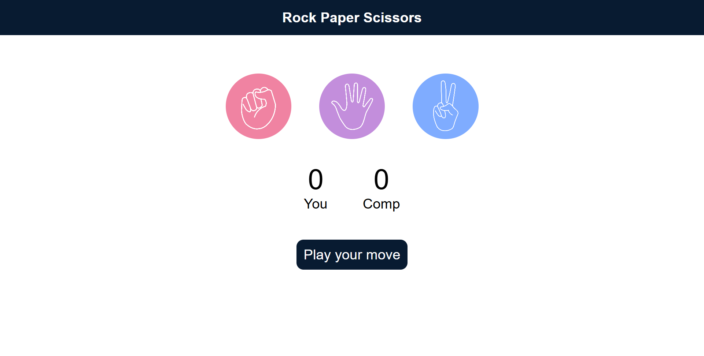

# Rock Paper Scissors Game

This is a simple Rock Paper Scissors game implemented using HTML, CSS, and JavaScript.  Users can play against the computer and the score is tracked on the page.

## How to Play

1. Open the `index.html` file in your web browser.
2. Click on one of the three choices: Rock, Paper, or Scissors.
3. The computer will randomly select its choice.
4. The winner is determined based on the classic Rock Paper Scissors rules.
5. The score is updated and a message is displayed indicating the result of the round.

## Technologies Used

- HTML: For structuring the content of the game.
- CSS: For styling the game elements.
- JavaScript: For implementing the game logic and interactivity.
