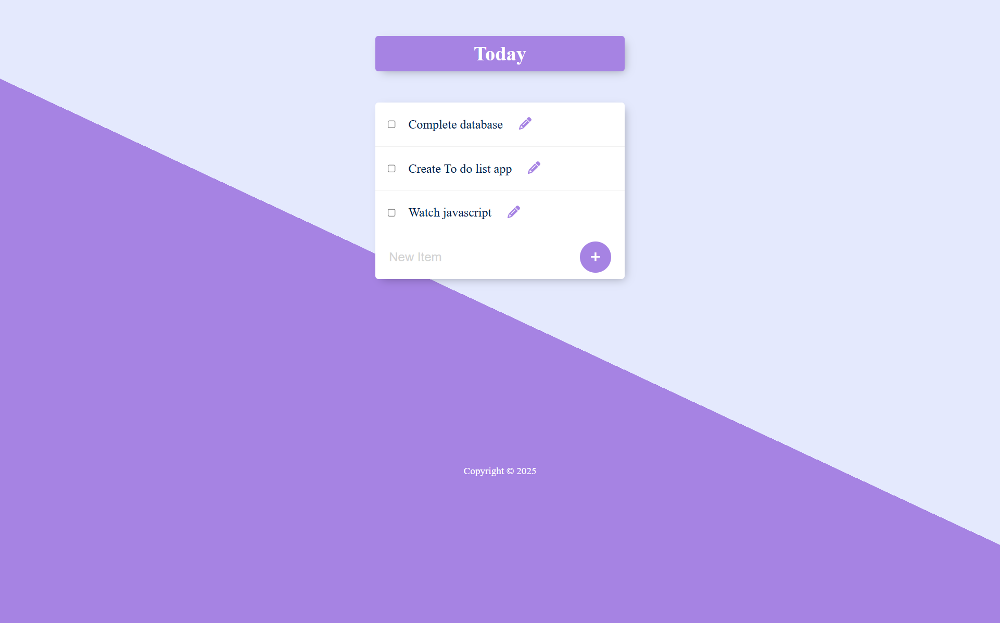

# To-Do List App

A simple To-Do List web application built using **Node.js**, **Express.js**, **EJS**, and **PostgreSQL**.

## Project Type

**Backend Project**

This project primarily focuses on backend development using **Node.js** and **Express.js**, with **EJS** as the templating engine and **PostgreSQL** as the database.

## Features

- Add new tasks to your daily to-do list.
- Edit existing tasks inline.
- Delete tasks upon completion.
- Responsive and aesthetically pleasing UI.

## Tech Stack

- **Frontend:** EJS, CSS
- **Backend:** Node.js, Express.js
